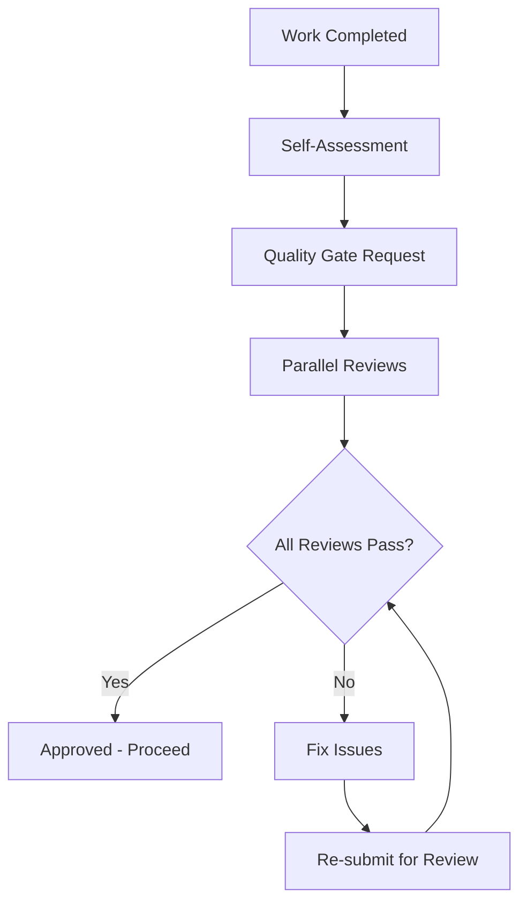

# Quality Gates System

## Overview

Quality gates are checkpoints in the development process that ensure no substandard work proceeds to the next phase. Each gate has specific criteria that must be met and designated agents responsible for validation. Nothing moves forward until all quality requirements are satisfied.

## Core Quality Principles

1. **Prevention Over Detection** - Catch issues early rather than fixing them later
2. **Multiple Perspectives** - Different agents review from their expertise areas
3. **Objective Criteria** - Clear, measurable standards for passing each gate
4. **Continuous Improvement** - Learn from quality issues to strengthen future gates
5. **Fail Fast** - Better to identify problems quickly than discover them in production
6. **⚠️ BLOCKING ENFORCEMENT** - Failed quality gates MUST STOP all progression
7. **NO BYPASS ALLOWED** - Quality gates cannot be skipped or circumvented

## ⛔ CRITICAL BLOCKING RULES ⛔

**MUST NOT PROCEED if ANY quality gate fails:**
- ❌ Code with failed reviews CANNOT be deployed
- ❌ Untested code CANNOT move to production
- ❌ Security vulnerabilities MUST be resolved before release
- ❌ Performance issues MUST be addressed before deployment
- ❌ Missing documentation BLOCKS handoffs to operations

**VIOLATION PENALTY**: Any bypass of quality gates requires immediate rollback and full re-validation.

## Quality Gate Types

### 1. Development Quality Gate 🔨

**Trigger**: Any code development work is completed
**Required Before**: Code can be merged or deployed
**⛔ BLOCKING**: Work MUST NOT PROCEED until ALL approvals are obtained

#### Required Approvals

**Code Review** - @code-review ⛔ BLOCKING
- [ ] Code follows established standards and conventions
- [ ] Code is readable and well-documented
- [ ] No code smells or anti-patterns detected
- [ ] Proper error handling implemented
- [ ] Security best practices followed
- [ ] Performance considerations addressed
**❌ FAILURE = DEPLOYMENT BLOCKED**

**Testing Validation** - @testing ⛔ BLOCKING
- [ ] Unit tests written and passing (>90% coverage)
- [ ] Integration tests cover critical paths
- [ ] Edge cases and error conditions tested
- [ ] Test documentation is complete
- [ ] No flaky or intermittent test failures
- [ ] Performance tests within acceptable limits
**❌ FAILURE = DEPLOYMENT BLOCKED**

**Security Assessment** - @security-testing ⛔ BLOCKING
- [ ] No critical or high-severity vulnerabilities
- [ ] Authentication/authorization properly implemented
- [ ] Data validation and sanitization in place
- [ ] Sensitive data handling follows compliance requirements
- [ ] Dependencies scanned for known vulnerabilities
- [ ] Security logging implemented where needed
**❌ FAILURE = DEPLOYMENT BLOCKED**

#### Quality Gate Process

```markdown
## Development Quality Gate - [Component Name]

**Requestor**: @[development-agent]
**Date**: [YYYY-MM-DD]
**Component**: [What was built/modified]

### Self-Assessment Checklist
- [ ] Code is complete and functional
- [ ] Unit tests written and passing
- [ ] Documentation updated
- [ ] No obvious performance issues
- [ ] Error handling implemented
- [ ] Ready for peer review

### Required Reviews

**@code-review** - Please review for:
- Code quality and standards compliance
- Architecture alignment
- Documentation completeness
- Maintainability concerns

**@testing** - Please validate:
- Test coverage meets requirements (>90%)
- All tests pass consistently
- Edge cases are covered
- Performance is acceptable

**@security-testing** - Please check:
- Security vulnerability scan
- Authentication/authorization correctness
- Data handling compliance
- Dependency security status

### Artifacts for Review
- Code Location: [Repository branch/PR link]
- Test Results: [Link to test report]
- Coverage Report: [Link to coverage data]
- Documentation: [Link to updated docs]
- Security Scan: [Link to scan results]

### Acceptance Criteria
- All reviewers provide ✅ PASS status
- No critical or high-priority issues remain
- Performance benchmarks met
- Security scan shows no critical vulnerabilities

**Status**: 🟡 Under Review / ✅ Approved / ❌ Requires Changes
```

### 2. Design Quality Gate 🎨

**Trigger**: Design work (UI/UX, Database Schema, API Design) is completed
**Required Before**: Implementation can begin

#### Required Approvals

**System Architecture Review** - @system-architect
- [ ] Design aligns with overall system architecture
- [ ] Integration points clearly defined
- [ ] Scalability requirements addressed
- [ ] Technology choices are appropriate
- [ ] Dependencies and constraints documented

**User Experience Review** - @ux-ui-design (for UI components)
- [ ] Design follows established design system
- [ ] User workflows are intuitive
- [ ] Accessibility requirements met (WCAG 2.1 AA)
- [ ] Mobile responsiveness considered
- [ ] Error states and edge cases designed

**Security Architecture Review** - @security-architecture
- [ ] Security requirements integrated into design
- [ ] Data privacy requirements addressed
- [ ] Authentication/authorization patterns defined
- [ ] Compliance requirements considered

#### Design Quality Gate Process

```markdown
## Design Quality Gate - [Design Component]

**Requestor**: @[design-agent]
**Date**: [YYYY-MM-DD]
**Design Type**: [UI/UX | Database Schema | API Design | System Architecture]

### Design Deliverables
- [ ] Design specifications complete
- [ ] Mockups/wireframes finalized
- [ ] User stories addressed
- [ ] Technical requirements documented
- [ ] Integration points defined

### Required Reviews

**@system-architect** - Please verify:
- Architectural alignment
- Integration feasibility
- Scalability considerations
- Technology appropriateness

**@ux-ui-design** - Please confirm (for UI designs):
- Design system compliance
- User experience quality  
- Accessibility standards
- Responsive design approach

**@security-architecture** - Please validate:
- Security requirements integration
- Data protection measures
- Authentication/authorization approach
- Compliance alignment

### Design Artifacts
- Specifications: [Link to design docs]
- Mockups/Wireframes: [Link to visual designs]
- User Flows: [Link to workflow diagrams]
- Technical Diagrams: [Link to architecture diagrams]

**Status**: 🟡 Under Review / ✅ Approved / ❌ Requires Changes
```

### 3. Database Quality Gate 🗄️

**Trigger**: Database schema changes or major database work completed
**Required Before**: Schema deployed to any environment

#### Required Approvals

**Schema Review** - @database-agent
- [ ] Schema design is normalized and optimized
- [ ] Indexes are properly defined
- [ ] Migration scripts are safe and tested
- [ ] Backup/rollback procedures defined
- [ ] Performance impact assessed

**Security Review** - @security-architecture
- [ ] Data access patterns secure
- [ ] Sensitive data properly protected
- [ ] Audit trails implemented where required
- [ ] Compliance requirements met

**Performance Review** - @performance-testing
- [ ] Query performance analyzed
- [ ] Scaling considerations addressed
- [ ] Load testing completed
- [ ] Resource usage within limits

#### Database Quality Gate Process

```markdown
## Database Quality Gate - [Schema Changes]

**Requestor**: @database-agent
**Date**: [YYYY-MM-DD]
**Change Type**: [New Schema | Schema Modification | Performance Optimization]

### Database Changes Summary
- [ ] Schema design complete
- [ ] Migration scripts written and tested
- [ ] Rollback procedures defined
- [ ] Documentation updated
- [ ] Performance impact assessed

### Required Reviews

**@database-agent** (Self Review):
- Schema optimization and normalization
- Index strategy effectiveness
- Migration safety and testing
- Backup/recovery procedures

**@security-architecture** - Please verify:
- Data protection measures
- Access control implementation
- Audit logging compliance
- Sensitive data handling

**@performance-testing** - Please validate:
- Query performance benchmarks
- Load testing results
- Resource utilization impact
- Scaling behavior

### Database Artifacts
- Schema Scripts: [Link to DDL files]
- Migration Scripts: [Link to migration files]
- Test Data: [Link to test datasets]
- Performance Results: [Link to benchmark data]
- Documentation: [Link to updated database docs]

**Status**: 🟡 Under Review / ✅ Approved / ❌ Requires Changes
```

### 4. Deployment Quality Gate 🚀

**Trigger**: Ready to deploy to staging or production
**Required Before**: Any deployment to shared environments

#### Required Approvals

**Infrastructure Readiness** - @infrastructure
- [ ] Environment properly configured
- [ ] Resources adequately provisioned
- [ ] Monitoring and alerting configured
- [ ] Backup systems operational
- [ ] Rollback procedures tested

**CI/CD Pipeline** - @ci-cd-pipeline
- [ ] Automated tests pass in pipeline
- [ ] Build artifacts created successfully
- [ ] Configuration management updated
- [ ] Deployment automation tested
- [ ] Rollback automation verified

**Monitoring Setup** - @monitoring
- [ ] Application metrics configured
- [ ] Error logging operational
- [ ] Performance monitoring active
- [ ] Business metrics tracked
- [ ] Alert thresholds defined

#### Deployment Quality Gate Process

```markdown
## Deployment Quality Gate - [Environment]

**Requestor**: @[requesting-agent]
**Date**: [YYYY-MM-DD]
**Target Environment**: [Staging | Production]
**Deployment Type**: [New Feature | Bug Fix | Infrastructure Change]

### Pre-Deployment Checklist
- [ ] All previous quality gates passed
- [ ] Code merged to deployment branch
- [ ] Configuration updated for target environment
- [ ] Database migrations tested
- [ ] Rollback plan documented and tested

### Required Approvals

**@infrastructure** - Please confirm:
- Environment readiness
- Resource capacity adequate
- Monitoring systems operational
- Backup procedures verified

**@ci-cd-pipeline** - Please validate:
- Pipeline execution successful
- All automated tests pass
- Build artifacts verified
- Deployment automation ready

**@monitoring** - Please verify:
- Monitoring configuration complete
- Alerting thresholds appropriate
- Logging systems operational
- Performance baselines established

### Deployment Artifacts
- Deployment Package: [Link to build artifacts]
- Configuration: [Link to environment config]
- Migration Scripts: [Link to database migrations]
- Rollback Plan: [Link to rollback procedures]
- Monitoring Config: [Link to monitoring setup]

**Go/No-Go Decision**: @system-architect

**Status**: 🟡 Under Review / ✅ Approved for Deployment / ❌ Not Ready
```

## Quality Standards Reference

### Code Quality Standards

**Coding Standards**:
- Follow language-specific style guides (ESLint for JavaScript, etc.)
- Use meaningful variable and function names
- Keep functions small and focused (< 50 lines typically)
- Comment complex business logic
- Remove dead code and commented code
- Use consistent formatting and indentation

**Architecture Standards**:
- Follow established patterns and conventions
- Maintain separation of concerns
- Use dependency injection where appropriate
- Implement proper error handling
- Follow security best practices
- Consider performance implications

**Testing Standards**:
- Unit test coverage > 90%
- Test critical business logic thoroughly
- Include edge case and error condition tests
- Use meaningful test descriptions
- Maintain test independence (no test dependencies)
- Mock external dependencies appropriately

### Performance Standards

**Response Time Requirements**:
- API endpoints: < 500ms for 95th percentile
- Database queries: < 100ms for single record lookups
- Page load times: < 2 seconds for first contentful paint
- File uploads: Progress indication for operations > 1 second

**Scalability Requirements**:
- Handle 10x current load without architectural changes
- Graceful degradation under high load
- Horizontal scaling capability where needed
- Efficient resource utilization (CPU, memory, network)

### Security Standards

**Authentication & Authorization**:
- Strong password policies enforced
- Multi-factor authentication for admin accounts
- Role-based access control implemented
- Session management follows best practices
- API endpoints properly secured

**Data Protection**:
- Sensitive data encrypted at rest and in transit
- PII data handling follows compliance requirements
- Input validation and sanitization implemented
- SQL injection and XSS protection in place
- Regular security dependency updates

## Quality Gate Workflows

### Standard Quality Gate Flow



### Escalation Process

When quality gates fail repeatedly or agents disagree on quality standards:

1. **Document the Issue**: Create escalation record with specific concerns
2. **Gather Stakeholders**: Include all relevant agents and system architect
3. **Technical Discussion**: Allow agents to present their positions
4. **Architect Decision**: System architect makes final call on quality standards
5. **Update Standards**: If needed, update quality gate requirements
6. **Re-review**: Apply new standards to pending work

### Quality Metrics Tracking

Track these metrics to improve quality gate effectiveness:

**Gate Performance**:
- Average time to complete reviews
- Pass rate on first submission
- Number of issues found per gate type
- Time from issue identification to resolution

**Quality Outcomes**:
- Production defect rate
- Security vulnerability count
- Performance regression incidents
- Customer satisfaction scores

## Emergency Quality Procedures

### Critical Issue Override

In true emergencies, quality gates can be temporarily bypassed with:

1. **System Architect Approval**: Must explicitly approve override
2. **Risk Assessment**: Document what quality checks are being skipped
3. **Immediate Remediation Plan**: Schedule follow-up quality review
4. **Monitoring Enhancement**: Increase monitoring during override period
5. **Post-Incident Review**: Analyze what led to emergency and prevent recurrence

### Quality Gate Override Template

```markdown
🚨 EMERGENCY QUALITY GATE OVERRIDE 🚨

**Approved By**: @system-architect
**Date**: [YYYY-MM-DD]
**Reason**: [Critical business justification]

**Skipped Quality Checks**:
- [ ] [Check 1] - Risk: [Description of risk]
- [ ] [Check 2] - Risk: [Description of risk]

**Compensating Controls**:
- [Control 1] - [How risk is mitigated]
- [Control 2] - [How risk is mitigated]

**Remediation Plan**:
- [ ] [Action 1] - Due: [Date] - Assigned: @[agent]
- [ ] [Action 2] - Due: [Date] - Assigned: @[agent]

**Enhanced Monitoring**:
- [Monitoring 1] - [What to watch]
- [Monitoring 2] - [Alert thresholds]

**Review Schedule**: [When to conduct post-incident review]

**Rollback Plan**: [How to quickly revert if issues arise]
```

## Continuous Improvement

### Quality Gate Retrospectives

After major releases, conduct quality gate effectiveness reviews:

**Questions to Address**:
- Which gates caught the most issues?
- Were there production issues that should have been caught earlier?
- Are gate criteria too strict or too lenient?
- How can we reduce review time without compromising quality?
- What additional gates or checks are needed?

### Quality Standards Evolution

Quality standards should evolve based on:
- New technology capabilities
- Lessons learned from production issues
- Industry best practice updates  
- Compliance requirement changes
- Team capability growth

### Success Metrics

**Quality Gate Success Indicators**:
- ✅ >95% of production deployments have zero critical issues
- ✅ <2% of releases require emergency patches
- ✅ Security vulnerability count decreasing over time
- ✅ Performance metrics consistently meet SLA requirements
- ✅ Customer satisfaction scores improving
- ✅ Team confidence in release quality high

Remember: Quality gates are not obstacles to slow down development—they are safety nets that enable faster, more confident delivery by catching issues early when they're cheaper and easier to fix.