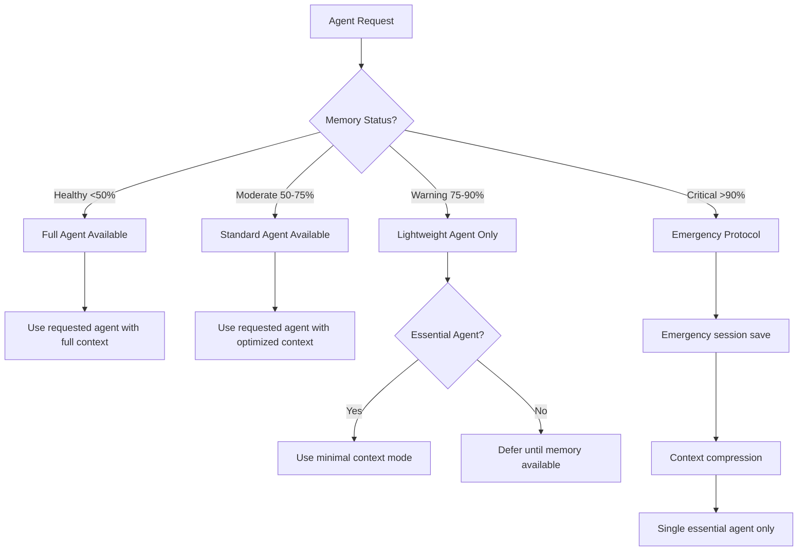

# Agent Selection Decision Trees
*Mega-Minds Variable-Driven Agent System v2.1*  
*Phase 3: Advanced Integration - Intelligent Agent Selection*

## Overview

This document provides automated decision trees for intelligent agent selection based on project context, task requirements, and system state. The decision trees integrate with the Variable-Driven Agent System to provide context-aware agent recommendations.

## Core Decision Framework

### Primary Decision Tree: Agent Selection by Context

```mermaid
graph TD
    A[Task Request] --> B{Project Phase?}
    
    B -->|Planning| C[Planning Agents]
    B -->|Development| D[Development Agents] 
    B -->|Quality| E[Quality Agents]
    B -->|Deployment| F[Deployment Agents]
    B -->|Maintenance| G[Maintenance Agents]
    
    C --> C1{Requirements Clear?}
    C1 -->|No| C2[@project-orchestrator-agent]
    C1 -->|Yes| C3{Architecture Needed?}
    C3 -->|Yes| C4[@technical-architecture-agent]
    C3 -->|No| C5[@market-research-agent]
    
    D --> D1{Frontend or Backend?}
    D1 -->|Frontend| D2[@frontend-development-agent]
    D1 -->|Backend| D3[@backend-development-agent]
    D1 -->|Database| D4[@database-agent]
    D1 -->|Both| D5[@project-orchestrator-agent]
    
    E --> E1{What Testing?}
    E1 -->|Code Review| E2[@code-review-agent]
    E1 -->|Security| E3[@security-testing-agent]
    E1 -->|Performance| E4[@performance-testing-agent]
    E1 -->|General| E5[@testing-agent]
    
    F --> F1{Infrastructure or Pipeline?}
    F1 -->|Infrastructure| F2[@infrastructure-agent]
    F1 -->|CI/CD| F3[@ci-cd-pipeline-agent]
    F1 -->|Monitoring| F4[@monitoring-agent]
    
    G --> G1{What Issue?}
    G1 -->|Bug| G2[@bug-tracker-agent]
    G1 -->|Performance| G3[@performance-optimizer-agent]
    G1 -->|Features| G4[@feature-manager-agent]
    G1 -->|Testing| G5[@ab-tester-agent]
```

### Memory-Aware Agent Selection



## Decision Rules Engine

### Rule Set 1: Planning Phase Decisions

#### Project Orchestrator Triggers
- **Always start with**: New projects, unclear requirements, multi-agent coordination needed
- **Memory consideration**: Can handle high memory usage, good for complex coordination
- **Context variables**: `{{CURRENT_PHASE}}` = 'Planning', `{{ACTIVE_AGENT_COUNT}}` = 0

```javascript
const shouldUseOrchestrator = (context) => {
  return (
    context.project.phase === 'Planning' ||
    context.task.complexity === 'high' ||
    context.activeAgents.count === 0 ||
    context.task.type === 'coordination'
  );
};
```

#### Requirements Analysis Agent Triggers
- **Use when**: Requirements unclear, stakeholder input needed, scope definition required
- **Memory consideration**: Medium memory usage, good for analysis tasks
- **Context variables**: `{{PROJECT_MISSION}}` undefined, requirements documentation missing

```javascript
const shouldUseRequirementsAgent = (context) => {
  return (
    !context.project.mission ||
    context.task.type === 'requirements' ||
    context.system.alerts.includes('unclear-requirements')
  );
};
```

### Rule Set 2: Development Phase Decisions

#### Frontend vs Backend Selection
```javascript
const selectDevelopmentAgent = (context) => {
  if (context.task.files.some(f => f.includes('frontend') || f.endsWith('.tsx'))) {
    return 'frontend-development-agent';
  }
  
  if (context.task.files.some(f => f.includes('api') || f.includes('server'))) {
    return 'backend-development-agent';
  }
  
  if (context.task.files.some(f => f.includes('schema') || f.includes('database'))) {
    return 'database-agent';
  }
  
  return 'project-orchestrator-agent'; // For complex/mixed tasks
};
```

#### Database Agent Specific Rules
- **Use when**: Schema design, migration, query optimization, data modeling
- **Memory consideration**: Low-medium memory usage
- **File triggers**: `*.sql`, `*schema*`, `*migration*`, database config files

### Rule Set 3: Quality Assurance Decisions

#### Code Review Agent Rules
```javascript
const shouldUseCodeReview = (context) => {
  return (
    context.task.type === 'review' ||
    context.git.hasChanges ||
    context.quality.testCoverage < 90 ||
    context.workflow.phase === 'pre-deployment'
  );
};
```

#### Security Testing Triggers
- **Use when**: Security concerns, authentication changes, API endpoints modified
- **Memory consideration**: Medium memory usage
- **File triggers**: Auth files, API routes, security configs, user management

#### Performance Testing Rules
```javascript
const shouldUsePerformanceTesting = (context) => {
  return (
    context.task.type === 'performance' ||
    context.system.performance.degraded ||
    context.project.phase === 'optimization' ||
    context.memory.usage > 75
  );
};
```

### Rule Set 4: Deployment & Operations Decisions

#### Infrastructure Agent Rules
- **Use when**: Server setup, cloud configuration, infrastructure changes
- **Memory consideration**: Medium-high memory usage
- **File triggers**: Docker files, cloud configs, infrastructure as code

#### CI/CD Pipeline Agent Rules
```javascript
const shouldUseCICD = (context) => {
  return (
    context.task.type === 'deployment' ||
    context.files.some(f => f.includes('pipeline') || f.includes('.yml')) ||
    context.git.branch === 'main' ||
    context.quality.gates.failed > 0
  );
};
```

## Context-Aware Decision Engine

### Decision Engine Implementation

```javascript
class AgentDecisionEngine {
  constructor(variableEngine, contextManager) {
    this.variableEngine = variableEngine;
    this.contextManager = contextManager;
    this.decisionRules = new Map();
    this.loadDecisionRules();
  }

  /**
   * Select optimal agent based on context and task
   * @param {Object} taskContext - Task and project context
   * @returns {Object} Agent selection result
   */
  selectAgent(taskContext) {
    const context = this.enrichContext(taskContext);
    const candidates = this.getCandidateAgents(context);
    const scored = this.scoreAgents(candidates, context);
    const selected = this.selectBestAgent(scored, context);
    
    return {
      selectedAgent: selected.agent,
      confidence: selected.score,
      reasoning: selected.reasoning,
      alternatives: scored.slice(1, 3),
      memoryImpact: this.assessMemoryImpact(selected.agent, context),
      recommendations: this.generateRecommendations(selected, context)
    };
  }

  /**
   * Get candidate agents based on primary filters
   */
  getCandidateAgents(context) {
    const phase = context.project.phase;
    const taskType = context.task.type;
    const memoryStatus = context.memory.status;
    
    let candidates = [];
    
    // Phase-based filtering
    switch (phase) {
      case 'Planning':
        candidates = ['project-orchestrator-agent', 'requirements-analysis-agent', 
                     'technical-architecture-agent', 'market-research-agent'];
        break;
      case 'Development':
        candidates = ['frontend-development-agent', 'backend-development-agent', 
                     'database-agent', 'authentication-agent'];
        break;
      case 'Quality':
        candidates = ['testing-agent', 'code-review-agent', 'security-testing-agent', 
                     'performance-testing-agent'];
        break;
      case 'Deployment':
        candidates = ['ci-cd-pipeline-agent', 'infrastructure-agent', 'monitoring-agent'];
        break;
      default:
        candidates = ['project-orchestrator-agent']; // Safe default
    }
    
    // Memory-based filtering
    if (memoryStatus === 'Critical') {
      candidates = candidates.filter(agent => this.isLowMemoryAgent(agent));
    }
    
    return candidates;
  }

  /**
   * Score agents based on context fit
   */
  scoreAgents(candidates, context) {
    return candidates.map(agent => {
      const score = this.calculateAgentScore(agent, context);
      const reasoning = this.generateReasoning(agent, context, score);
      
      return {
        agent: agent,
        score: score,
        reasoning: reasoning
      };
    }).sort((a, b) => b.score - a.score);
  }

  /**
   * Calculate agent fitness score
   */
  calculateAgentScore(agent, context) {
    let score = 0;
    
    // Base phase alignment (0-40 points)
    score += this.getPhaseAlignment(agent, context.project.phase) * 40;
    
    // Task type alignment (0-30 points)  
    score += this.getTaskAlignment(agent, context.task.type) * 30;
    
    // Memory efficiency (0-15 points)
    score += this.getMemoryEfficiency(agent, context.memory) * 15;
    
    // File type alignment (0-10 points)
    score += this.getFileAlignment(agent, context.task.files) * 10;
    
    // Recent success rate (0-5 points)
    score += this.getSuccessRate(agent, context) * 5;
    
    return Math.round(score);
  }

  /**
   * Check if agent is suitable for low memory conditions
   */
  isLowMemoryAgent(agent) {
    const lowMemoryAgents = [
      'testing-agent',
      'code-review-agent', 
      'bug-tracker-agent',
      'performance-optimizer-agent'
    ];
    return lowMemoryAgents.includes(agent);
  }

  /**
   * Generate human-readable reasoning for selection
   */
  generateReasoning(agent, context, score) {
    const reasons = [];
    
    if (this.getPhaseAlignment(agent, context.project.phase) > 0.8) {
      reasons.push(`Optimal for ${context.project.phase} phase`);
    }
    
    if (this.getTaskAlignment(agent, context.task.type) > 0.8) {
      reasons.push(`Specialized in ${context.task.type} tasks`);
    }
    
    if (context.memory.status === 'Critical' && this.isLowMemoryAgent(agent)) {
      reasons.push('Memory-efficient for current system state');
    }
    
    if (score > 80) {
      reasons.push('High confidence match');
    } else if (score > 60) {
      reasons.push('Good contextual fit');
    } else {
      reasons.push('Available alternative');
    }
    
    return reasons.join(', ');
  }

  /**
   * Assess memory impact of agent selection
   */
  assessMemoryImpact(agent, context) {
    const agentMemoryUsage = {
      'project-orchestrator-agent': 'high',
      'technical-architecture-agent': 'high', 
      'frontend-development-agent': 'medium',
      'backend-development-agent': 'medium',
      'database-agent': 'medium',
      'testing-agent': 'low',
      'code-review-agent': 'low',
      'bug-tracker-agent': 'low'
    };
    
    const usage = agentMemoryUsage[agent] || 'medium';
    const currentUsage = context.memory.usage;
    
    let impact = 'acceptable';
    if (usage === 'high' && currentUsage > 70) {
      impact = 'concerning';
    } else if (usage === 'medium' && currentUsage > 85) {
      impact = 'risky';
    }
    
    return { usage, impact };
  }
}
```

## Quick Selection Guide

### By File Type
| File Pattern | Recommended Agent |
|--------------|-------------------|
| `*.tsx`, `*.jsx`, `*.vue` | `@frontend-development-agent` |
| `*.api.*`, `*/server/*` | `@backend-development-agent` |
| `*.sql`, `*schema*`, `*migration*` | `@database-agent` |
| `*.test.*`, `*.spec.*` | `@testing-agent` |
| `*.yml`, `*pipeline*` | `@ci-cd-pipeline-agent` |
| `Dockerfile`, `*infra*` | `@infrastructure-agent` |

### By Task Keywords
| Keywords | Recommended Agent |
|----------|------------------|
| "requirements", "scope", "analysis" | `@requirements-analysis-agent` |
| "architecture", "design", "system" | `@technical-architecture-agent` |
| "database", "schema", "migration" | `@database-agent` |
| "auth", "login", "security" | `@authentication-agent` |
| "test", "coverage", "quality" | `@testing-agent` |
| "deploy", "pipeline", "build" | `@ci-cd-pipeline-agent` |
| "performance", "optimize", "slow" | `@performance-testing-agent` |
| "bug", "error", "fix" | `@bug-tracker-agent` |

### By Memory Pressure
| Memory Status | Recommended Agents | Avoid |
|---------------|-------------------|-------|
| **Healthy (0-50%)** | Any agent | None |
| **Moderate (50-75%)** | Any except orchestrator for simple tasks | Complex orchestrations |
| **Warning (75-90%)** | Single-purpose agents only | `@project-orchestrator-agent` |
| **Critical (90%+)** | Emergency protocol only | All except essential fixes |

## Emergency Decision Protocols

### Critical Memory State (>90%)
1. **Immediate Actions**:
   - Save current session: `npx mega-minds save-session "emergency_save"`
   - Compress context: `npx mega-minds compress-context`
   - Use only essential agents with minimal context

2. **Agent Selection**:
   - Prefer: `@bug-tracker-agent`, `@testing-agent`, `@code-review-agent`
   - Avoid: `@project-orchestrator-agent`, `@technical-architecture-agent`

3. **Escalation Path**:
   - If critical work needed: Consider Claude Code restart
   - Document current state before restart
   - Use `@project-orchestrator-agent` for context recovery

### Agent Coordination Failures
1. **Detection**: Coordination success rate < 80%
2. **Response**: 
   - Switch to `@project-orchestrator-agent`
   - Review handoff protocols in `workflows/communication-protocol.md`
   - Check agent boundaries in `workflows/agent-boundaries.md`

## Integration with Variable System

### Decision Variables
```javascript
const decisionVariables = {
  // Context Variables
  '{{RECOMMENDED_AGENT}}': selectedAgent.agent,
  '{{SELECTION_CONFIDENCE}}': selectedAgent.confidence,
  '{{SELECTION_REASONING}}': selectedAgent.reasoning,
  '{{MEMORY_IMPACT}}': selectedAgent.memoryImpact.impact,
  '{{ALTERNATIVE_AGENTS}}': selectedAgent.alternatives.map(a => a.agent).join(', '),
  
  // Decision Metrics
  '{{DECISION_TIME}}': decisionTime,
  '{{CANDIDATE_COUNT}}': candidateCount,
  '{{DECISION_FACTORS}}': factorsConsidered.join(', ')
};
```

### Usage in Claude.md
```markdown
## 🤖 Recommended Agent
**Current Recommendation**: {{RECOMMENDED_AGENT}}  
**Confidence**: {{SELECTION_CONFIDENCE}}%  
**Reasoning**: {{SELECTION_REASONING}}  
**Memory Impact**: {{MEMORY_IMPACT}}  

**Alternatives**: {{ALTERNATIVE_AGENTS}}
```

## Performance Metrics

### Decision Engine Performance Targets
- **Decision Time**: <200ms for simple selections, <500ms for complex
- **Accuracy**: >90% user satisfaction with recommendations  
- **Memory Efficiency**: <5% additional memory overhead
- **Cache Hit Rate**: >85% for repeated similar contexts

### Success Metrics
- **Agent Selection Accuracy**: Track actual vs recommended agent usage
- **Task Success Rate**: Measure completion rates by agent selection method
- **Memory Optimization**: Improvement in memory-aware selections
- **User Satisfaction**: Survey ratings for agent recommendations

## Command Integration

### New Commands for Decision Support
```bash
# Get agent recommendation for current context
npx mega-minds recommend-agent

# Get detailed decision reasoning  
npx mega-minds explain-agent-selection

# Test decision engine with specific context
npx mega-minds test-agent-decision --context="development,frontend,memory-warning"

# View decision engine statistics
npx mega-minds decision-stats
```

---

*Decision Trees Version: 1.0*  
*Last Updated: January 2025*  
*Integration: Variable-Driven Agent System v2.1*